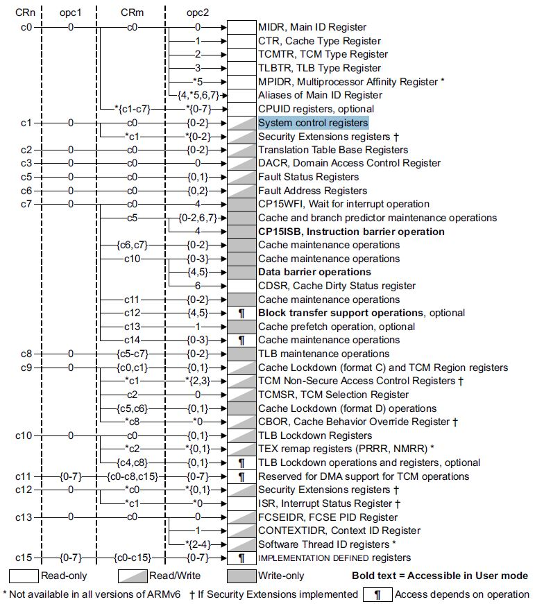

# X4412 U-Boot详细解析

---
（本文大部分内容均来自麦子学院童佳音老师的讲解，如需引用，请注明出处，谢谢！）  
PS. 童老师的视频是我迄今见到过的所有讲解U-Boot的书籍和课程中最好的一份资料，没有之一！  
我本人从中获益良多，也借此表示对童老师深深的敬意！  

### 移植环境  

- 开发环境 ： Win7（64位） + Virtualbox + Ubuntu16.04（64位）  
- 主开发板 ： [九鼎创展X4412](http://www.9tripod.com/index.php)  

| 器件  | 型号              | 厂商     | 描述                                           |
| ---- | ---------------- | ------- | --------------------------------------------- |
| CPU  | Exynos 4412      | Samsung | Cortex-A9, Quad Core                          |
| DDR  | NT5CB128M16FP-D1 | Nanya   | DDR3x4, 2Gb, 128Mx16, 800MHz, BGA96           |
| eMMC | THGBMBG6D1KBAIL  | Toshiba | MLC NAND, Serial, 3.3V, 64G-bit, 153-Pin FBGA |

- 基础u-boot版本 ： u-boot-2015-10  
- 交叉编译工具链 ： 友善之臂提供的arm-linux-gcc-4.5.1-v6-vfp-20101103.tgz  

简单说下，Exynos 4412这个CPU是Cortex-A9内核的，而网络上教程比较多的S5PV210是Cortex-A8内核的，这两款CPU都是基于ARMv7架构的。A9支持多核，市面上流行的ARM多核基本是A9起步。目前最新的Cortex-A系列已经是基于ARMv8架构的了，ARMv8架构开始支持64bit。  

### 如何调试U-Boot  
通常有两种方式对bootloader程序进行调试，第一是采用在线调试工具，比如jlink或open-jtag等；第二是完全依靠开发板上的硬件，在最初阶段什么都不具备的时候，使用板上的LED灯来表示运行步骤，在串口初始化完毕后采用串口信息协助调试。  

这两种方法比较的话，在线调试当然是最方便的，可以随时打断点、dump内存信息等，但是在bootloader阶段的程序，这种方案通常未必可行，因为这种调试方法所需的一些基本条件在bootloaer阶段都还尚未具备。借助串口调试的方法虽然灵活性比较差、效率低下，但是在bootloader程序调试阶段却往往比较有效。  

总结一下，如果某个平台已经具备了成熟的在线调试方案，当然要选在线调试，但如果在线调试环境本身存在许多问题，稳定性很差，则不如退回到串口调试方案，虽然麻烦一点，但绝对是可行的。  

### 中断向量表  

u-boot-2015-10工程中，入口地址应该是哪里？传统的U-Boot的入口都是arch/arm/cpu/armv7/start.S这个文件，但是打开u-boot-2015-10工程的这个文件，会发现最前面的部分竟然不是中断向量！入口地址处难道不是中断向量吗？绝无可能，那么想找到线索，还是要回头来查看arch/arm/cpu/u-boot.lds文件，在这个链接脚本文件会看到，整个工程的入口是“_start”，参考下面这句：
```
ENTRY(_start)
```
那么这个_start又在什么地方呢？全局搜索工程会发现这个标号在arh/arm/lib/vectors.S文件中。如下：
```armasm
_start:
#ifdef CONFIG_SYS_DV_NOR_BOOT_CFG
	.word	CONFIG_SYS_DV_NOR_BOOT_CFG
#endif
	b	reset
	ldr	pc, _undefined_instruction
	ldr	pc, _software_interrupt
	ldr	pc, _prefetch_abort
	ldr	pc, _data_abort
	ldr	pc, _not_used
	ldr	pc, _irq
	ldr	pc, _fiq
```
这便是整个工程的入口了。但是这个文件中并不存在reset标号，reset在哪里呢？它在arch/arm/cpu/armv7/start.S这个文件中，从这里开始，该U-boot工程的流程便和以前的U-boot差不多了。

严格来说“中断向量表”这个叫法并不严谨，因为这里处理的是一些“异常”。一般情况下，“异常”比“中断”的优先级要高，它是指CPU在运行期间遇到的一些有问题的状况，比如这里看到的指令异常、预取指异常等等。遇到这些问题时CPU必须停下来去做相应的处理，而不能“屏蔽”异常。但是“中断”则不同，中断是一些外设发来的打断CPU正常处理顺序的一些外部信号，这些信号取决于用户的需要，是可以选择性进行屏蔽的。

再来看这些异常处理的具体形式，比如：  
```armasm
ldr	pc, _undefined_instruction
```

这里的ldr是一条ARM汇编指令，它的意思是将内存地址中的某个内容加载至寄存器，也就是“load to register”的意思，因此，ldr指令的第二个参数的含义是取得这个标号所指示的内存地址处的内容，将其加载到第一个参数所指定的寄存器中去。注意，是加载第二个参数所指示的内存地址处的内容，而不是加载内存地址。  

ldr指令的用法如下：  
```armasm
ldr   R0，[R1]				;将存储器地址为R1的字数据读入寄存器R0。
ldr   R0，[R1，R2]			;将存储器地址为R1+R2的字数据读入寄存器R0。
ldr   R0，[R1，#8]			;将存储器地址为R1+8的字数据读入寄存器R0。
ldr   R0，[R1，R2] !		;将存储器地址为R1+R2的字数据读入寄存器R0，并将新地址R1＋R2写入R1。
ldr   R0，[R1，#8] !		;将存储器地址为R1+8的字数据读入寄存器R0，并将新地址R1＋8写入R1。
ldr   R0，[R1]，R2			;将存储器地址为R1的字数据读入寄存器R0，并将新地址R1＋R2写入R1。
ldr   R0，[R1，R2，LSL#2] !	;将存储器地址为R1＋R2×4的字数据读入寄存器R0，并将新地址R1＋R2×4写入R1。
ldr   R0，[R1]，R2，LSL#2	;将存储器地址为R1的字数据读入寄存器R0，并将新地址R1＋R2×4写入R1。
```
中括号是指将源寄存器的值解释为一个内存地址，而将内存地址处的内容加载到目的寄存器。  

vectors.S文件中的处理其实并不多，主要都是关于中断向量表的直接处理，下面把vectors.S中的主要处理都列出来：  
```armasm
_undefined_instruction:	.word undefined_instruction
_software_interrupt:	.word software_interrupt
_prefetch_abort:	.word prefetch_abort
_data_abort:		.word data_abort
_not_used:		.word not_used
_irq:			.word irq
_fiq:			.word fiq

	.balignl 16,0xdeadbeef

/* SPL interrupt handling: just hang */

#ifdef CONFIG_SPL_BUILD

	.align	5
undefined_instruction:
software_interrupt:
prefetch_abort:
data_abort:
not_used:
irq:
fiq:

1:
	bl	1b			/* hang and never return */

#else	/* !CONFIG_SPL_BUILD */

/* IRQ stack memory (calculated at run-time) + 8 bytes */
.globl IRQ_STACK_START_IN
IRQ_STACK_START_IN:
	.word	0x0badc0de

/*
 * exception handlers
 */

	.align  5
undefined_instruction:
	get_bad_stack
	bad_save_user_regs
	bl	do_undefined_instruction

	.align	5
software_interrupt:
	get_bad_stack
	bad_save_user_regs
	bl	do_software_interrupt

	.align	5
prefetch_abort:
	get_bad_stack
	bad_save_user_regs
	bl	do_prefetch_abort

	.align	5
data_abort:
	get_bad_stack
	bad_save_user_regs
	bl	do_data_abort

	.align	5
not_used:
	get_bad_stack
	bad_save_user_regs
	bl	do_not_used
	
#endif	/* CONFIG_SPL_BUILD */
```
可以看到对于中断向量的处理分为了spl（即定义了宏CONFIG_SPL_BUILD的情况）和非spl（未定义宏CONFIG_SPL_BUILD的情况）两种。其中spl的情况非常简单，就是将所有的异常处理都简单的设定为“死循环”，就是下面这个处理：
```armasm
1:
	bl	1b			/* hang and never return */
```
而非spl的处理才是真正的异常处理。那啥叫spl呢，这个必须从三星Exynos4412的启动方式说起。  

做过2410开发的程序员大都会有这么一个印象，三星采用了一种非常怪异的启动方式，即stepping stone方式（从Nand Flash）开始bootloader的运行。相对于这种方式，从Nor启动的方式则容易理解很多。为什么要设计出这么一个怪异的stepping stone的启动方式呢？直到我最近看到了一篇文章，才想明白了其中的关键。Nor Flash虽然支持随机访问，很适合用于固件的启动，但制造工艺决定了制作大容量的Nor Flash是一件非常麻烦的事情。不仅如此，Nor Flash的速度也是个大问题。因此三星从很早就开始考虑一种绕开Nor Flash的启动方式，即从Nand Flash启动的方式（stepping stone），当然Nand Flash是不支持随机访问的，因此在启动之初将Nand Flash中的先加载至内存再运行就成了一个非常合理的选择。  

这种stepping stone的方式在后来的6410、V110/210和4412等ARM系列CPU中都得到了发展。在这种启动机制下，三星的设想是这样，先将Nand Flash中的Bootloader代码先加载至片内RAM（通常是SRAM），在Bootloader中初始化片外RAM，然后再将Linux等操作系统之类的大型程序加载到片外RAM中运行。  

理想很丰满，现实很骨感。三星不曾想到U-boot之类的通用启动程序的尺寸越来越大，通常CPU片上SRAM的容量都在几十到几百KB这个量级，但目前U-Boot的整体尺寸通常超过500KB，因此这里就存在了一个矛盾，U-Boot根本无法整体装入片上SRAM！介于此，U-Boot设计者另辟蹊径，将U-Boot一分为二，第一部分称做uboot-spl，这个代码是先加载到片上RAM的，它的尺寸通常很小，主要完成片外RAM初始化的工作；第二部分才是真正具备Bootloader功能的代码，即通常意义的uboot，它的尺寸较大，通常被直接加载至片外RAM，完成Linux等后续程序的引导。  

具体的异常处理代码中还有一个要注意的ARM汇编语法，即汇编宏定义。如下：  
```armasm
.macro get_bad_stack
……
.endm
```
既然叫作宏，那么它和C/C++中的宏定义作用是一样的，用的时候直接展开就可以了。  

关于中断向量表还有一个必须要搞清楚的问题，那就是它的加载地址。熟悉MCU开发的程序员可能习惯了中断向量表被摆放在0x00000000或者0xFFFF0000这一做法，这也是ARM处理器规范定义的方式（两个地址的切换可以通过cp15协处理器进行配置）。但在4412中，这并不是常见的方式。为什么呢，因为在ARM9中，0x00000000地址通常对应的是内部iROM地址，这个地址是程序员无法修改的，而Bootloader程序（通常是U-Boot），也就是三星定义的BL2，它通常会被加载至0x02023400这一地址，也就是说，按照正常的加载方式，中断向量表（BL2的开始部分）将位于0x02023400这个地址，这怎么办呢？   

ARM处理器的设计者显然也考虑到了这个问题，因此他们借助于cp15协处理器搞了另外一套机制来规避这个头大的0地址悖论。该机制是这样来运行的，在cp15协处理器中设计了一个VBAR寄存器，用户可以通过这个寄存器来将中断向量表的首地址映射到内存的任意地址。开启这个VBAR后，异常发生时便不再跳转至0地址，而是跳转至VBAR中写好的地址，这样就不存在0地址不能访问的问题了。  

三星公司在稍早些的CPU，如S5PV210中还尝试了另外一种机制，即当程序在片内RAM运行时，处理器开辟一块自己的中断向量表映射区，用户可以将代码中的中断向量表拷贝至这里，当异常发生时，程序会跳转到这个片内RAM地址，这也也解决了0地址无法使用的问题。  

uboot-spl运行时，异常发生的情况比较少，后面的U-Boot主要关注在外存中运行时的情况，也就是设定并启动VBAR的动作，这可以在start.S的分析中看到。  

### 从start.S开始

#### <头文件>  

先来看start.S文件最前面的include部分。
```armasm
#include <asm-offsets.h>
#include <config.h>
#include <asm/system.h>
#include <linux/linkage.h>
```
到哪里去找这些include头文件呢？一般是下面两个目录：
1. 根目录下的include目录
2. arch/arm/include目录
这两个目录都是直接在Makefile配置文件中显示指定的。

比如上面的system.h头文件，它保存在arch/arm/include/asm目录下，而linkage.h头文件则保存在include/linux目录下。

下面我们循着start.S中reset的运行轨迹，一步步的来解析这个start.S中究竟做了一些什么操作。  

#### <晦涩的宏展开>  

先看第一段代码。start.S和中断向量表衔接的部分就是reset标号，它的相关处理如下：
```armasm
reset:
	/* Allow the board to save important registers */
	b	save_boot_params
save_boot_params_ret:
	mrs	r0, cpsr
……
ENTRY(save_boot_params)
	b	save_boot_params_ret		@ back to my caller
ENDPROC(save_boot_params)
	.weak	save_boot_params
```
这是一个非常怪的家伙，因为save_boot_params_ret又返回到最前面的reset函数那里去了。所以这个函数其实啥也没干。那它是干啥用的呢？其实它是在OMAP处理器的初始化中使用的，这里就不多关注它了。  

来看看ENTRY和ENDPROC两个宏会展开成什么样子。  

ENTRY这个宏是在include/linux/linkage.h中定义的。相关代码如下：
```armasm
#define ASM_NL		 `	/* define in asm/linkage.h, and use '`' to mark new line in macro */

#define SYMBOL_NAME(X)		X

#ifdef __STDC__
#define SYMBOL_NAME_LABEL(X)	X##:
#else
#define SYMBOL_NAME_LABEL(X)	X:
#endif

#ifndef __ALIGN
#define __ALIGN .align		4
#endif

#define ALIGN			__ALIGN

#define LENTRY(name) \
	ALIGN ASM_NL \
	SYMBOL_NAME_LABEL(name)

#define ENTRY(name) \
	.globl SYMBOL_NAME(name) ASM_NL \
	LENTRY(name)

#define WEAK(name) \
	.weak SYMBOL_NAME(name) ASM_NL \
	LENTRY(name)

#ifndef END
#define END(name) \
	.size name, .-name
#endif

#ifndef ENDPROC
#define ENDPROC(name) \
	.type name STT_FUNC ASM_NL \
	END(name)
#endif
```
有一个常用的知识点，像.type、.size和.weak这类定义应该在gcc的[汇编器as的手册](https://sourceware.org/binutils/docs/)中去查询，记住哦。  
所以，ENTRY和ENDPROC两个宏的部分全部展开后会是下面这个样子：  
```armasm
.globl save_boot_params
.align 4
save_boot_params
b	save_boot_params_ret
.type save_boot_params STT_FUNC
.size save_boot_params, .-save_boot_params
.weak save_boot_params
```
这里完整的意思应该是这样：
- 定义一个全局标号save_boot_params
- 该标号的首地址是4字节对齐的
- 执行命令（调用这个函数）
- 执行命令（返回）
- 该标号是一个函数名
- 该函数的长度可以计算出来
- 该标号是一个弱标号

#### <切换到超级用户模式>  

再看第二段代码——save_boot_params_ret。这里注释写得很清楚，是要将CPU切换至超级用户（supervisor）模式，具体处理如下：
```armasm
save_boot_params_ret:
	/*
	 * disable interrupts (FIQ and IRQ), also set the cpu to SVC32 mode,
	 * except if in HYP mode already
	 */
	mrs	r0, cpsr
	and	r1, r0, #0x1f		@ mask mode bits
	teq	r1, #0x1a				@ test for HYP mode
	bicne	r0, r0, #0x1f		@ clear all mode bits
	orrne	r0, r0, #0x13		@ set SVC mode
	orr	r0, r0, #0xc0		@ disable FIQ and IRQ
	msr	cpsr,r0
```
这里主要是通过对cpsr寄存器的设定来完成的，这个寄存器是属于ARM内核的状态寄存器。说到这里，应该首先梳理一下ARM的寄存器设计。  

ARM处理器共有37个寄存器，这37个寄存器按照其在用户编程中的功能划分，可分为两类寄存器，即31个通用寄存器和6个状态寄存器。6个状态寄存器在ARM按照公司的名称分别为：CPSR、SPSR_svc、SPSR_abt、SPSR_und、SPSR_irq和SPSR_fig。所有处理器模式下都可访问当前程序状态寄存器CPSR。CPSR中包含条件码标志、中断禁止位、当前处理器模式以及其他状态和控制信息。每种异常模式下都有一个对应的程序状态寄存器SPSR。当异常出现时，SPSR用于保存CPSR的状态，以便异常返回后恢复异常发生时的工作状态。  

CPSR有4个8位区域：标志域（F）、状态域（S）、扩展域（X）、控制域（C）。通常会用MRS或MSR指令来读写CPSR寄存器的内容。  

关于CPSR寄存器的详细信息应该去《ARMv7 Architecture Reference Manual ARMv7-A and ARMv7-R edition》这个手册（以下简称ARMv7 ARM）中去查询（我的手册版本在1148页）。具体来说，CPSR的寄存器描述如下表所示：   

|31~28|  27 |26~25|  24 |23~20|19~16|15~10|  9  | 8~6 |  5  | 4~0 |
| --- | --- | --- | --- | --- | --- | --- | --- | --- | --- | --- |
|N,Z,C,V|Q|IT[1:0]|J|Reserved|GE[3:0]|IT[7:2]|  E  | A,I,F |  T  |M[4:0]|

回头来看上面那段代码，mrs指令先将CPSR寄存器中的内容读至r0，然后中间的一堆and和orr操作主要做了两件事情：  
1. 将Mode（最低5位）置为Supervisor模式；  
2. 将I位（中断）和F位（快中断）禁止；  

然后在将r0的值写回到CPSR寄存器，这样就完成了这个函数的所有功能。  

#### <中断向量表重定位>  

下面来到第三段代码，这段代码有个条件编译选项，它的含义是除了OMAP的spl以外都需要编译，也就是说，这段代码在4412的U-Boot中肯定是有效的。详细的代码如下：  
```armasm
/*
 * Setup vector:
 * (OMAP4 spl TEXT_BASE is not 32 byte aligned.
 * Continue to use ROM code vector only in OMAP4 spl)
 */
#if !(defined(CONFIG_OMAP44XX) && defined(CONFIG_SPL_BUILD))
	/* Set V=0 in CP15 SCTLR register - for VBAR to point to vector */
	mrc	p15, 0, r0, c1, c0, 0	@ Read CP15 SCTLR Register
	bic	r0, #CR_V		@ V = 0
	mcr	p15, 0, r0, c1, c0, 0	@ Write CP15 SCTLR Register

	/* Set vector address in CP15 VBAR register */
	ldr	r0, =_start
	mcr	p15, 0, r0, c12, c0, 0	@Set VBAR
#endif
```
这段代码主要是做我们之前提到的一件事情，即设定VBAR，也就是将中断向量表重新定位。  

这部分处理牵涉到一个很重要的知识点，即cp15协处理器的设定。cp15是一个协处理器，这是ARM内核规范中就设计好的，这个协处理器中存在几十个寄存器，提供了花样繁多的控制功能。协处理器也不只有cp15，还有cp14（debug功能）、cp13/cp12（保留）、cp11（双精度计算）、cp10（单精度计算）、cp9/cp8（保留）、cp7~cp0（给厂商使用）等，只不过cp15协处理器中的功能我们编程时使用到的频率比较高，因为cp15涉及了MMU管理、Cache管理、中断向量管理等常用功能。  

观察上面关于cp15寄存器的操作指令，可以知道，读写协处理器寄存器的方法和读写通用寄存器基本是相同的，都是采用所谓“读/修改/写”方式，只不过具体的读写指令参数有些不同。  

mrc指令（读取协处理器寄存器的值，写入到通用寄存器中）的格式像下面这样：  
```armasm
mrc p15, <opc1>, <Rd>, <CRn>, <CRm>, <opc2>
```
要了解这些参数的含义，还得借助手册。cp15寄存器的详细信息在ARMv7 ARM中有详细的描述，可以参考下图（我的手册版本在2526页）：  
   
*图1 cp15协处理器寄存器组成*     

其中CRn从c0到c15的寄存器还有各自的详细图示，就不在此全部列举了。总的来说，可以这样来理解cp15协处理器中寄存器的组织。首先根据cr0将cp15协处理器中的寄存器分为了c0到c15，共计16组寄存器，然后根据cr1将每组寄存器又详细分为不同的子寄存器组。  

现在再来看上面的最先出现的一对mrc和mcr指令所对应的寄存器，因为CRn=C1，ocp1=0，CRm=c0，opc2=0，因此可以查询到对应的是要操作“System control registers”，继续看手册后面的说明，得知先头这几句主要是要将SCTLR的V位清空，也就是将中断向量表设定为使用低地址（0x00000000），此时系统可以进行Remap（中断向量表重映射）。  

后面还有一句mcr的操作：  
```armasm
ldr	r0, =_start
mcr	p15, 0, r0, c12, c0, 0	@Set VBAR
```
它的作用是将“_start”标号处的地址放入cp15的c12寄存器中，这个VBAR就是重定位后的中断向量表地址。  

关于协处理器，由其是cp15的设定方法我们应该牢记心中，需要的时候应该能够迅速从手册中查找到相关信息，这样在分析ARM的系统级代码时方可从容不迫。  

#### <底层初始化>  

下面来到了第四段代码，这是两个函数调用，分别是cpu_init_cp15和cpu_init_crit。这两个函数是一些底层初始化函数，包括CPU的时钟、Cache、MMU等，都会在这里进行初始化。  
```armasm
	/* the mask ROM code should have PLL and others stable */
#ifndef CONFIG_SKIP_LOWLEVEL_INIT
	bl	cpu_init_cp15
	bl	cpu_init_crit
#endif
```
这两个函数都要以CONFIG_SKIP_LOWLEVEL_INIT这个宏作为编译的选项，这种以“CONFIG_”或“CONFIG_SYS_”开头的宏定义就是俗称的开发板配置选项。这些配置选项在哪里可以找到呢？基本上全在include/configs/x4412.h这个文件下定义。打开这个x4412.h文件，看到它又包含了configs/exynos4-common.h文件，再打开exynos4-common.h文件，发现它又包含了exynos-common.h文件，在exynos-common.h文件中，可以找到CONFIG_SKIP_LOWLEVEL_INIT的定义。      

这也就是说，以上两个初始化操作不被调用！一开始我在这里走了很长的弯路，一定要小心啊。为啥这里非常重要的cp15寄存器的初始化不做了呢？要注意CONFIG_SKIP_LOWLEVEL_INIT这个宏是在exynos-common.h文件中定义的，也就是说，Exynos系列CPU的CP15协处理器中的相关寄存器的默认值一定和U-Boot需要设定的值是相同的，比如开机后MMU的关闭状态等。    

虽说如此，我还是想在这里稍微分析一下这个cpu_init_cp15函数，因为这个函数在其它一些Cortex-A9的CPU中基本是必须执行的函数。  
  
那为什么这里又分成了两个函数呢？我们看看两个函数里面的处理内容会发现，第一个函数主要是做一些必须使用汇编进行的动作，第二个函数是调用一个lowlevel_init函数，而这实际上是一个C语言写成的函数，因为这些处理不涉及特殊功能寄存器，因此直接用C语言进行编程更为方便。像lowlevel_init这种调用方式我们俗称为钩子函数，在Boot程序中非常常见。  

先来仔细分析一下cpu_init_cp15这个函数。  
```armasm
/*************************************************************************
 *
 * cpu_init_cp15
 *
 * Setup CP15 registers (cache, MMU, TLBs). The I-cache is turned on unless
 * CONFIG_SYS_ICACHE_OFF is defined.
 *
 *************************************************************************/
ENTRY(cpu_init_cp15)
	/*
	 * Invalidate L1 I/D
	 */
	mov	r0, #0			@ set up for MCR
	mcr	p15, 0, r0, c8, c7, 0	@ invalidate TLBs
	mcr	p15, 0, r0, c7, c5, 0	@ invalidate icache
	mcr	p15, 0, r0, c7, c5, 6	@ invalidate BP array
	mcr     p15, 0, r0, c7, c10, 4	@ DSB
	mcr     p15, 0, r0, c7, c5, 4	@ ISB

	/*
	 * disable MMU stuff and caches
	 */
	mrc	p15, 0, r0, c1, c0, 0
	bic	r0, r0, #0x00002000	@ clear bits 13 (--V-)
	bic	r0, r0, #0x00000007	@ clear bits 2:0 (-CAM)
	orr	r0, r0, #0x00000002	@ set bit 1 (--A-) Align
	orr	r0, r0, #0x00000800	@ set bit 11 (Z---) BTB
#ifdef CONFIG_SYS_ICACHE_OFF
	bic	r0, r0, #0x00001000	@ clear bit 12 (I) I-cache
#else
	orr	r0, r0, #0x00001000	@ set bit 12 (I) I-cache
#endif
	mcr	p15, 0, r0, c1, c0, 0

#ifdef CONFIG_ARM_ERRATA_716044
	mrc	p15, 0, r0, c1, c0, 0	@ read system control register
	orr	r0, r0, #1 << 11	@ set bit #11
	mcr	p15, 0, r0, c1, c0, 0	@ write system control register
#endif

	mov	r5, lr			@ Store my Caller
……
	mov	pc, r5			@ back to my caller
ENDPROC(cpu_init_cp15)
```
开始部分的操作可以笼统的理解为是关闭Cache，当然，每一句汇编都对应着一个具体的CPU功能。  

- invalidate TLBs ： 废弃TLB结果  
- invalidate icache ： 废弃指令Cache结果  
- invalidate BP array ： 废弃分支预测结果  
- DSB ： 废弃多核CPU之间的数据同步结果  
- ISB ： 废弃同一个内核中的指令同步结果，即放弃流水线中已经取到的指令，重新取指令  

这里面比较陌生的是TLB，这是个什么东东呢？TLB和MMU相关，但MMU本身要做的事好理解，而TLB所对应的页表概念却不好理解。为了理解TLB，我们从头来梳理一下CPU内存寻址的分页机制。  

大家可能听说过内存管理的分段和分页。这两个机制虽然名称非常相似，但是本质上没有一毛钱关系。  

在1978年Intel发布8086处理器之前，CPU的内存访问一直都采用绝对地址（直接物理地址）的方式，也就是说寻址操作中不存在任何的转换。在8086这个CPU身上发生了一件非常诡异的事情，即它是一款16位的CPU，但是却有20根地址总线，可以在1M的范围内寻址。在以前，如果是一款16位CPU，那就是说它的地址总线和寄存器都是16位的，这样它可访问的内存空间最大就只有64K。  

其实，以前的那种方式当然是不合理的，因为仔细分析一下就可以知道，寄存器的位宽受限于CPU的综合设计考量，但是地址总线的宽度其实对应的是存储空间的大小，存储空间是可以根据用户的需求进行扩充的，它的范围当然不应该受限于寄存器的宽度。所以，从8086开始，Intel就开始考虑，如何用16位的ALU去取20位的地址。为了解决这个问题，8086引入了“分段”的概念。所以说，分段机制的引入是为了解决“地址总线的宽度大于寄存器的宽度”这个问题的。  

分段的机制说起来其实很简单，就是采用段地址+偏移量的做法，在80286之后的CPU中这种地址访问模式被称为“实模式”。  

1982年，Intel又发布了80286处理器，首次引入了“保护模式”，80286有24位地址线和16M的寻址能力。但由于80286分段仍然是64K，应用程序的规模受到很大限制，因此很快80286就被市场抛弃了。  

1985年，Intel发布了80386处理器，它拥有32位地址总线，寻址能力达到4G，同时它的分段大小也达到了4G。这是一款划时代的处理器，之所以这样讲，是因为80386之后的处理器虽然在主频和处理能力上依然突飞猛进，但是这种32位+4G寻址+保护模式+分页+分段的组合机制却被长期稳定了下来，这就是经常被大家挂在口头的x86架构。当然，近些年来64位处理器的兴起，事实上已经成功的升级了这一传统的经典架构，这是后话了。  

那么，“分页”到底是个什么东西呢？简单来说，CPU外挂的物理内存可能没有4G这么大，但是CPU的寻址能力已经达到了4G，因此可能出现访问“根本不存在的内存”的情况。那怎么办呢，大家一定都听说过，这就是将数据在内存和硬盘之间倒来倒去的这种“权宜”的做法。但是在这种倒腾内存空间的操作中，如果以“段”内存为单位来进行是完全不合适的，因为“分段”机制所划分的“段”内存，其长度是不一定的。为了解决这个问题，从80386开始，又引入了“分页”机制。所以说，分页机制的引入是为了解决“寻址范围超过实际物理内存”这个问题的。  

这么说很难理解，但实际上它确实也是一个非常晦涩难懂的概念，很多有多年从业经验的程序员对此也几乎是一无所知（这也是该机制设计巧妙的一种体现）。大家只能凑合看了:(  

分页机制不光被x86体系处理器采用，ARM处理器也使用了相同的机制。实现分页机制的基础是引入页表的概念。页表一般都很大，并且存放在内存中。在处理器引入了页表机制后，读取指令、数据需要访问两次内存：首先通过查询页表得到物理地址，然后访问该物理地址读取指令、数据。为减少因为页表访问导致的处理器性能下降，因此又引入了TLB。TLB是“Translation Lookaside Buffer”的缩略语，可译为“地址转换缓冲器”，也称为“快表”。简单地说，TLB就是页表的Cache，其中存储了当前最可能被访问到的页表项，其内容是部分页表项的一个副本。只有在TLB无法完成地址翻译任务时，才会到内存中查询页表，这样就减少了页表查询导致的处理器性能下降。  

好了，费了半天劲，总算是把TLB这个家伙的来龙去脉给基本说清楚了。在U-Boot的初始化阶段，这类旨在提高速度的CPU机制会产生一些意想不到的结果。比如Catch等功能是通过CP15管理的，刚上电时，CPU还未初始化它们，所以此时这类功能导致的结果必须废弃，否则可能想从数据Catch里面取，而此时RAM中数据还没有加载至Cache，而导致数据预取发生异常。分支预测、多核同步、TLB结果的废弃都是基于这个理由。  

下面再来说说Cache的问题。要理解Cache的由来，需要先理解CPU的哈佛结构和冯诺依曼结构的区别。事实上，哈佛结构的出现要早于冯诺依曼结构，它是在1944年IBM的霍华德·艾肯给哈佛大学设计的一台计算机Mark 1（马克一型）时采用的结构，该机器被视为现代计算机的鼻祖，它的ROM部分是用打孔带实现的（图灵的设想），RAM部分是用继电器实现的。这种结构的特点是将程序码与程序数据分开进行放置的，也就是说，CPU连接外部ROM（存放代码）时需要一组地址总线，CPU连接外部RAM时需要另外一组地址总线。  

如果是在一块芯片的内部实现CPU、RAM和ROM，哈佛结构并没有什么特别的问题，但是，现代计算机的CPU和ROM、RAM通常是分开设计的，因此CPU和ROM/RAM间就需要外部总线来连接（在PCB上走线），这样的话，哈佛总线的劣势——地址线数目过多，就显现出来了。  

在比Mark 1稍晚时候在宾夕法尼亚大学制造的另一台伟大的计算机——ENIAC（埃尼阿克）上，冯诺依曼提出了另一种结构。冯诺依曼敏锐的意识到，其实代码从另一种角度看也可以视为一种数据，这样，计算机硬件结构中就不必强行将RAM和ROM与CPU的连接区分为两种不同的总线，使用统一的总线即可。ENIAC同时采用了真空管作为存储介质，这也为后来计算机的发展奠定了基础。  

冯诺依曼结构CPU在后来的微型计算机时代大行其道，其主要原因就是这种结构有效的减少了CPU与外部存储器的连接，在缩小机器体积的同时实现了很好的可制造性。但是，冯诺依曼结构有个很大的问题，就是指令的读取和数据的读取常常发生冲突，为了缓解这一问题，后来的CPU设计中又引入了Cache的设计，其实就是把指令和数据缓存在CPU的片上RAM中，以此来提高指令和数据的访问速度。  

因为U-Boot最初运行时，Cache中生成的内容是不可控的，因此，必须要在U-Boot初始化阶段先废弃掉Cache中的内容，这里的invalidate icache这句代码就是这个意思了。  

下面还有两句指令，一个注释为DSB，另一个注释为ISB，它们的含义是清空已经预取到流水线中的指令。有趣的是，在旧的ARM处理器版本中，这两个动作是通过cp15协处理器的设定完成的，而在新版的ARM处理器手册中，ARM强烈建议直接使用DSB和ISB这两句指令来替代过去对于cp15协处理器的操作，显然，这个版本的U-Boot还没有来得及对此进行修改与测试。  

接下来再来看看禁用MMU的处理。首先，为啥要禁用MMU呢？因为MMU是一个把虚拟地址转化为物理地址的机制，在U-Boot的初始化阶段，固件程序所要做的是设置控制寄存器，而控制寄存器采用的是实地址（物理地址），不是虚拟地址，使能MMU反而是南辕北辙的操作。  

再来看所谓的禁用MMU的具体操作，按照上述对cp15寄存器的操作分析，这次操作的是VMSA的SCTLR（参考我手册版本的1707页），这里进行了下面几个操作：  
- clear bits 13 (--V-)  
- clear bits 2:0 (-CAM)  
- set bit 1 (--A-) Align  
- set bit 11 (Z---) BTB  
- clear bit 12 (I) I-cache  

按照手册上的解释，相应位的含义分别是：  
- V：中断向量表低地址/高地址  
- I：指令Cache开启/关闭  
- Z：分支预测开启/关闭  
- C：数据Cache开启/关闭  
- A：对齐检测开启/关闭  
- M：MMU开启/关闭  

要理解的是，这段处理才是MMU和数据Cache的关闭处理，而最上面的那一段处理，仅仅是废弃之前的Cache结果，这是完全不一样的。而且分支预测功能只是把之前预测的结果舍弃，这个功能本身还是要打开的，而指令Cache可以打开，也可以关闭。  

另外有个要解释的概念，ARM的手册中将CPU分为了PMSA和VMSA两种，PMSA是指具备MPU（不具备MMU）结构的CPU，VMSA是指具备MMU结构的CPU。  

说完了主要的处理，再来看一下cpu_init_cp15中许许多多名称为CONFIG_ARM_ERRATA_XXXXX这样的宏定义控制的处理，这些处理对应的是一些什么操作呢？它们对应的CPU手册的勘误表，而XXXXX所代表的数字，则是CPU勘误表的编号。注意，这些是由于CPU的Bug引起的，也就是说，如果将来CPU修正了这些错误，就不需要这些操作了。  

好了，说完了cpu_init_cp15的处理之后再来看一看cpu_init_crit这个函数。这个函数先是在start.S文件的结尾处调用了一个lowlevel_init的函数，这个lowlevel_init在哪里呢，它是在和start.S同目录下的另一个汇编语言源文件lowlevel_init.S当中。进入lowlevel_init.S这个文件，可以看到它的主体如下：  
```armasm
ENTRY(lowlevel_init)
	ldr	sp, =CONFIG_SYS_INIT_SP_ADDR
	bic	sp, sp, #7 /* 8-byte alignment for ABI compliance */
#ifdef CONFIG_SPL_DM
	mov	r9, #0
#else
#ifdef CONFIG_SPL_BUILD
	ldr	r9, =gdata
#else
	sub	sp, sp, #GD_SIZE
	bic	sp, sp, #7
	mov	r9, sp
#endif
#endif
	push	{ip, lr}
	bl	s_init
	pop	{ip, pc}
ENDPROC(lowlevel_init)
```
最后一部分很好理解，就是去调用一个名叫s_init的函数，然后返回。那前面的处理是在干什么呢？是在准备一个临时的栈空间，因为即将调用的s_init是一个C语言写成的函数，因此必须要预先为它配置栈空间。  

根据ARM的规范，C语言所使用的栈空间必须是8字节对齐的，因此就有了下面的这一句：  
```armasm
bic	sp, sp, #7 /* 8-byte alignment for ABI compliance */
```
注意这里，sp本来是赋予了一个预先定义好的栈空间地址，但是程序在这里基于容错的目的，检查了这个栈地址是否是8字节的整数倍，如果不是，则强行给该地址清空后面的三个比特，也就是进行了强制的8字节对齐。  

还有一个值得一说的地方是这部分代码中出现了ldr伪指令。所谓伪指令，是说ARM机器指令中并不存在任何与其相对应的指令，但汇编器（软件）可以识别这些伪指令，在汇编器进行汇编时，它会将其翻译为等价的一句或是几句机器指令。比如ldr这条伪指令，它的第二个操作数前面有一个等号，它的意思是将某个立即数直接赋值给寄存器。注意，是将这第二个操作数直接加载到寄存器，而不是将其解释为地址。  
ldr这句ARM汇编伪指令对于ARM初学者经常是一大杀手，原因有二：  
1. 这条伪指令的名字和一条真正的ARM指令相同(ldr指令)；  
2. 加载立即数不是用真正的mov汇编指令就能搞定吗？为啥冒出这个ldr伪指令。原因在于mov指令是不能加载32位立即数的，如果加载32位立即数，通常CPU需要两条以上的机器指令，这样表达很麻烦，因此借用ldr伪指令来描述。  

无论如何，我们一定要注意ldr指令和ldr伪指令是两个完全不同的东西~~  

#### <_main函数里到底是什么> 

哇，终于看到了下面这句代码，来到了_main函数！  
```armasm
bl	_main
```
别急，这并不是我们熟悉的C语言入口，那是main函数，而不是这个前面带有下划线的_main函数。那_main函数是啥意思呢，是向着main前进的意思吧，呵呵，从_main函数到main函数还有很长的路要走呢！  

先来找找这个_main函数在什么地方。它在arch/arm/lib/crt0.S之中，这又是一个巨大的汇编文件，需要我们沉下心来继续仔细解析。  

这个文件的开头，有一段非常详尽的注释，值得好好研读一下，下面把这段注释翻译为中文。  

>*该文件进行的是U-Boot的位置无关代码部分进入C运行环境之前的准备工作。它的入口点是start.S文件中的_main函数调用。*  
*_main函数的执行顺序如下：*  
*1.  设置调用board_init_f函数的的初始环境。该环境仅提供堆栈和一个保存GD（全局变量）的空间，两者都被定位在已经准备好的RAM区域（包括SRAM，已经锁定了的高速缓存等）。在当前的上下文环境中，全局变量，无论是初始化过的还是未初始化的（BSS），都是不可用的。只有常数这种已经初始化了的数据是可用的。GD应该在调用board_init_f函数之前被清零。*  
*2.  调用board_init_f函数。该函数为在系统内存（包括DRAM、DDR等存储设备）上执行而进行硬件准备。因为当前系统RAM尚不可以使用，board_init_f函数必须使用GD结构来存储后来运行阶段要用到的一些信息。这些信息包括重定位的目标地址、将来的堆栈位置、将来的GD结构位置等。*  
*3.  设置一个临时环境，在该环境下board_init_f函数在系统内存上分配了堆栈和存储GD的空间，但是BSS和已初始化的非常量数据仍然无法使用。*  
*4a. 对于正式的U-Boot（不是SPL），调用relocate_code函数。该函数将U-Boot从当前位置加载到由board_init_f函数计算的目的地址。*  
*4b. 对于SPL，board_init_f函数只返回到crt0，不存在代码的重定位。*  
*5.  调用board_init_r函数设置最终运行环境。该环境包括定位在系统RAM上的BSS（初始化为0）、已初始化的非常量数据、以及系统堆栈（在SPL中可以通过CONFIG_SPL_STACK_R宏来定义是否需要堆栈和GD结构）。GD结构将仍然保留在board_init_f函数中设定的信息。*  
*6.  对于正式的U-Boot（不是SPL），部分CPU关于内存配置还有一些特别的工作要做，所以它们需要调用c_runtime_cpu_setup函数。*  
*7.  跳转到board_init_r函数。*  
*更多信息，请参考README中的“电路板初始化流程”。*  

这个README文件是位于U-Boot根目录下的，既然提到了这个文件，也顺便说一下，这个文件对于理解U-Boot处理流程也是有很大帮助的，可以考虑全文仔细阅读一番。这里只是简单总结一下README中“电路板初始化流程”的主要内容。  

>*板级初始化分为三个阶段：*  
*1. lowlevel_init函数*  
*- 函数功能定位：允许执行到达board_init_f（C语言执行环境）的必要初始化*  
*- 没有GD或BSS*  
*- 没有堆栈（ARMv7可能有一个但很快就会删除）*  
*- 不得设置SDRAM或使用控制台*  
*- 必须只做最低限度以允许继续执行*  
*2. board_init_f函数*  
*- 函数功能定位：设置机器准备好运行board_init_r（即使用SDRAM和串行UART）*  
*- GD可用*  
*- 堆栈在SRAM中*  
*- BSS不可用，不能使用全局/静态变量，只有堆栈变量和GD*  
*3. board_init_r函数：*
*- 函数功能定位：准备通用C代码执行所需要的环境*  
*- GD可用*  
*- SDRAM可用*  
*- BSS可用，可以使用所有静态/全局变量*  
*- 将处理跳转至main_loop*  

上面这一段说明清楚的解释了U-Boot在初始化阶段不同系统资源准备完成的时刻，主要包括SRAM堆栈、SDRAM堆栈、GD、BSS、UART。理解这一点非常重要，因为它是我们在移植一个新系统时判断处理应该加入何处的重要依据。  

#### <_main函数中的第一部分>   
仔细来观察_main函数的内部，这里其实就是上面README中所说的lowlevel_init函数（不同平台的U-Boot在这里的函数命名有所不同，这里还是按照4412的代码，称为_main函数）。  

我们将crt0.S这个文件分解成了三段，并去除了一些和主体初始化处理无关的代码。可以很清晰的理解这部分处理的轮廓：在第一段的末尾，_main函数主动的调用了board_init_f函数，在第三段的末尾，_main函数永久的跳转至了board_init_r函数，不再返回了，C语言运行环境的初始化就此完成！  

_main函数中第一部分代码如下：  
```armasm
ENTRY(_main)
#if defined(CONFIG_SPL_BUILD) && defined(CONFIG_SPL_STACK)
	ldr	sp, =(CONFIG_SPL_STACK)
#else
	ldr	sp, =(CONFIG_SYS_INIT_SP_ADDR)
#endif
	
	bic	sp, sp, #7	/* 8-byte alignment for ABI compliance */
	mov	r2, sp
	sub	sp, sp, #GD_SIZE	/* allocate one GD above SP */
	bic	sp, sp, #7	/* 8-byte alignment for ABI compliance */
	
	mov	r9, sp		/* GD is above SP */
	mov	r1, sp
	mov	r0, #0
clr_gd:
	cmp	r1, r2			/* while not at end of GD */
	
	strlo	r0, [r1]		/* clear 32-bit GD word */
	addlo	r1, r1, #4		/* move to next */
	blo	clr_gd
	
	/* mov r0, #0 not needed due to above code */
	bl	board_init_f
```
第一段代码的开头我们是似曾相识的，没错，它和s_init中的处理是一样的：准备一个栈空间，其地址在spl中为CONFIG_SPL_STACK，在正式的u-boot中为CONFIG_SYS_INIT_SP_ADDR，并强制将其修改为8字节对齐。  

和s_init不同的是，这里的处理需要在栈空间之上，再准备一块称之为GD（全局数据）的空间，其大小为GD_SIZE，并将此空间全部清零，这样一来在board_init_f函数中，我们就可以使用GD和SRAM上的栈空间了。注意，在这部分代码运行时，是没有任何可用的存储空间的（除寄存器以外）！    

是不是看上去很简单？但是，在这看似平淡无奇的代码上，发生了U-Boot的第一次重要转折！  

到此为止，spl和正式的u-boot代码基本上走的都是相同的路径，只有少数处理靠CONFIG_SPL_BUILD宏区分开来。但是，从这个board_init_f函数开始，spl和正式的u-boot开始分道扬镳！在spl中，这个board_init_f是定义在arch/arm/mach-exynos/spl_boot.c当中的，但在正式的u-boot中，该函数定义在common/board_f.c中。   

#### <spl中的board_init_f函数>   
提示一句，此时已经进入C语言的世界，采用Source Insight来读代码的话会更省力一些。注意，前面的汇编部分之所以没采用Source Insight，是因为它只能识别x86的汇编，而无法解析ARM的汇编！  

先来看看spl当中的board_init_f函数，因为这里就是spl的终结了，所以在该函数的最后，它会将正式的u-boot拷贝至外部RAM，并采用一个强制跳转，进入正式的u-boot的处理流程。该函数的主体处理如下。  
```c
void board_init_f(unsigned long bootflag)
{
	__aligned(8) gd_t local_gd;
	__attribute__((noreturn)) void (*uboot)(void);

	setup_global_data(&local_gd);

	if (do_lowlevel_init())
		power_exit_wakeup();

	copy_uboot_to_ram();

	/* Jump to U-Boot image */
	uboot = (void *)CONFIG_SYS_TEXT_BASE;
	(*uboot)();
	/* Never returns Here */
}
```

这里面主要做了三件事情：  
1. 准备GD结构；  
2. 进行低级初始化；  
3. 拷贝正式的U-Boot到外部RAM，并跳转到外部RAM上执行。  

该函数中出现了\_\_attribute\_\_((noreturn))，这个用法的意思是指明函数没有返回值，另外，CONFIG_SYS_TEXT_BASE定义为0x43E00000，在x4412.h文件中，这是一个外部RAM的地址。  

下面来逐步分析这三个步骤的处理中主要都干了些什么。  

#### <setup_global_data函数>   
setup_global_data函数的实际代码非常简单。  
```c
static void setup_global_data(gd_t *gdp)
{
	gd = gdp;
	memzero((void *)gd, sizeof(gd_t));
	gd->flags |= GD_FLG_RELOC;
	gd->baudrate = CONFIG_BAUDRATE;
	gd->have_console = 1;
}
```

函数的代码虽然简单，但是GD的概念却不好理解，是时候来说说GD是个什么东西了。  

要理解GD（global data）的意义，需要先理解这样一个事实，U-Boot是一个bootloader，在有些情况下，它可能位于系统的只读存储器（ROM或者Flash）中，并从那里开始执行。因此，这种情况下，在U-Boot执行的前期（在将自己copy到可读写的存储器之前），它所在的存储空间，是不可写的。这样会造成两个问题：  
1. 堆栈无法使用，无法执行函数调用，也即C环境不可用。  
2. 没有data段（或者正确初始化的data段）可用，不同函数或者代码之间，无法通过全局变量的形式共享数据。  

对于问题1，通常的解决方案是在U-Boot运行起来之后，在那些不需要执行任何初始化动作即可使用的、可读写的存储区域内开辟一段堆栈（stack）空间。一般来说，大部分的平台（如很多ARM平台），都有自己的SRAM，可用作堆栈空间。如果实在不行，也有可借用CPU的Cache（用法不详）。栈空间的起始地址在哪里呢？还记得之前的_main函数吗，它一开始就设置了这个地址，spl中为CONFIG_SPL_STACK，在正式的u-boot中为CONFIG_SYS_INIT_SP_ADDR。    

对于问题2，解决方案要复杂一些。首先，对于开发者来说，在U-Boot本身被拷贝到可读写的RAM之前，永远不要使用全局变量。其次，在将自己拷贝到RAM之前，不同模块之间，确实有通过全局变量的形式传递数据的需求时，采用GD结构（global data）来解决。  

为了在将自己拷贝到RAM前通过全局变量传递数据，U-Boot设计了一个巧妙的方法，具体来说它是怎么做的：   
1. 定义一个名为global_data的结构体（代码中的结构体名为gd_t），里面保存了各色各样需要传递的数据（预先定义好，因为要使用片上SRAM，因此容量是有限的，一定理解这一点）。该结构体的具体内容，可以参考include/asm-generic/global_data.h文件中的定义。  
2. 堆栈配置好之后，在堆栈开始的位置留出一段，作为GD结构的使用空间，并将GD的开始地址（就是一个struct global_data指针）保存在一个固定的寄存器中，在后续需要对GD进行访问时，均通过该指针进行。  

GD的访问是使用r8寄存器来实现的，可以参考下面的代码：  
```C  
#define DECLARE_GLOBAL_DATA_PTR     register volatile gd_t *gd asm ("r8")
```  

GD结构包含的项目确实很多，下面把不带编译选项的项目都列出来解释一下吧，因为这家伙在U-Boot移植中太重要了！  
- bd : 这是一个用于保存开发板的相关参数的结构体，后面用到的时候再讲  
- flags : 这是一个表示GD数据自身可靠程度的一个标志，目前定义了12种状态  
- baudrate : 串口波特率  
- cpu_clk : CPU时钟频率（以Hz为单位）  
- bus_clk : （内部/外部？）总线时钟频率（以Hz为单位）  
- pci_clk : PCI总线时钟频率（以Hz为单位）  
- mem_clk : 内存工作频率（以Hz为单位）  
- have_console : 要不要调用serial_init函数  
- env_addr : 环境变量结构体的地址  
- env_valid : 环境变量的Checksum检查是否通过？  
- ram_top : U-Boot使用RAM的结束地址  
- relocaddr : U-Boot使用RAM的开始地址  
- ram_size : U-Boot使用RAM的总容量  
- mon_len : Monitor的长度？  
- irq_sp : IRQ栈指针  
- start_addr_sp : 栈指针（U-Boot的C语言程序）  
- reloc_off :   
- new_gd : 重定向后的GD结构体的地址  
- fdt_blob : 设备树  
- new_fdt : 重定向后的FDT  
- fdt_size : FDT的尺寸  
- jt : 跳转表  
- env_buf[32] : 重定向之前的getenv函数所使用的缓冲区  
- timebase_h : 基准时刻的高32位  
- timebase_l : 基准时刻的高32位  
- cur_serial_dev : 当前的串行设备  
- arch : CPU架构信息（很大一个结构体）  

回头看setup_global_data中的处理，它是把定位后的GD结构全部清零，然后将GD的flags置为GD_FLG_RELOC（代码重定位至RAM），然后设定串口为可用，并设定其波特率。关于这些设定，可以在后续处理中看到它们是如何被应用的。    

#### <do_lowlevel_init函数>   
spl中的board_init_f的第二步是执行低级初始化，即调用do_lowlevel_init函数。这个函数位于arch/arm/exynos/lowlevel_init.c文件之中。先贴上do_lowlevel_init函数的代码。  
```c
int do_lowlevel_init(void)
{
	uint32_t reset_status;
	int actions = 0;

	arch_cpu_init();

	reset_status = get_reset_status();

	switch (reset_status) {
	case S5P_CHECK_SLEEP:
		actions = DO_CLOCKS | DO_WAKEUP;
		break;
	case S5P_CHECK_DIDLE:
	case S5P_CHECK_LPA:
		actions = DO_WAKEUP;
		break;
	default:
		/* This is a normal boot (not a wake from sleep) */
		actions = DO_CLOCKS | DO_MEM_RESET | DO_POWER;
	}

	if (actions & DO_POWER)
		set_ps_hold_ctrl();

	if (actions & DO_CLOCKS) {
		system_clock_init();
#ifdef CONFIG_DEBUG_UART
		exynos_pinmux_config(PERIPH_ID_UART3, PINMUX_FLAG_NONE);
		debug_uart_init();
#endif
		mem_ctrl_init(actions & DO_MEM_RESET);
		tzpc_init();
	}

	return actions & DO_WAKEUP;
}
```

此处的处理完成了大部分spl打算完成的功能。下面简单列出其中主要函数的功能。  
1. arch_cpu_init ：该函数位于arch/arm/cpu/armv7/s5p-common/cpu_info.c，主要功能就是配置pro_id、cpu_id和cpu_rev，这样后面就可以使用cpu_is_xxx之类的接口选择外设的不同基地址或寄存器组。该处理的主要部分可参考arch/arm/mach-exynos/include/mach/cpu.h，在Exynos4412的情况下CPU的ID为0x412。（注意，configure_l2_ctlr到secondary_cores_configure这一系列函数因为编译宏的原因其实不会被包含进spl工程，这点可根据spl的反汇编看到。）   
2. get_reset_status ：该函数位于arch/arm/mach-exynos/power.c中，它的作用是判断CPU启动时处于什么模式。如果是从普通关机状态启动，那么需要初始化电源、存储部分、时钟；如果是从睡眠状态唤醒，需要初始化时钟、执行唤醒流程；如果是从空闲或LPA模式唤醒，只需要执行唤醒流程。这里大概说下Exynos系列CPU的一个特点，该系列CPU有一个名叫LPA（Low Power Audio）的子系统，专门用于在节电模式下播放音频，这个对于手机来说很重要。在LPA模式下，存储模块一直是处于带电状态的。在此我们只讨论从普通关机状态启动，因此下面的一系列函数都需要执行（只有UART部分需要看编译宏的情况，在我们的U-Boot中，这个部分也是要执行的）。  
根据不同的CPU型号来初始化CPU和时钟，这个操作要借助SAMSUNG_BASE系列宏，而这个宏又要用到上面取得的CPU的ID。顺着这个函数追踪下去，会发现一个samsung_get_base_##device的家伙（这个不太好找，因为是在宏定义中，这也可以看出使用宏定义虽然提高了编码的效率，但是对程序整体的可读性造成了破坏），它定义在arch/arm/mach-exynos/include/mach/cpu.h中，原型如下面的代码所示。可以看出，它会返回一个EXYNOS4X12_##base形式的地址，这里其实就是EXYNOS4_POWER_BASE，对应的地址是0x10020000。也就是说，通过这个寄存器可以查询到上述CPU启动时的状态。   
```c
#define SAMSUNG_BASE(device, base)				\
static inline unsigned int __attribute__((no_instrument_function)) \
	samsung_get_base_##device(void) \
{								\
	if (cpu_is_exynos4()) {				\
		if (proid_is_exynos4412())			\
			return EXYNOS4X12_##base;		\
		return EXYNOS4_##base;				\
	} else if (cpu_is_exynos5()) {				\
		if (proid_is_exynos5420() || proid_is_exynos5800())	\
			return EXYNOS5420_##base;		\
		return EXYNOS5_##base;				\
	}							\
	return 0;						\
}
```
3. set_ps_hold_ctrl ：片上的PS Hold功能只在Exynos5XXX系列CPU中被支持（九鼎的Exynos4412开发板中，PS Hold功能是通过片外的电路实现的），因此该函数在Exynos4412开发板中不会被执行。   
4. system_clock_init ：该函数定义在arch/arm/mach-exynos/clock_init_exynos4.c中。可以看到，相对于其它Exynos4XXX系列CPU来说，Exynos4412的时钟初始化处理是比较特殊的，详细处理这里就不讨论了。   
（exynos_pinmux_config和debug_uart_init两个函数是用于初始化调试用串口的，这里不再分析。）     
7. mem_ctrl_init ：该函数定义在arch/arm/mach-exynos/dmc_common.c中。这里是对外部RAM，也就是DDR的初始化。童佳音老师的视频中对DDR进行了详尽的介绍，这里不再多说。有一点要强调的是，在完成这个函数的处理后，外部DDR第一次处在了可用状态！   
8. tzpc_init ：该函数定义在arch/arm/mach-exynos/tzpc.c中。这里是对Trust Zone进行初始化，关于Trust Zone是个什么东西，这实在又是一个太大的话题，就不在这里展开讲了，可以参考[《一篇了解Trust Zone》](https://blog.csdn.net/guyongqiangx/article/details/78020257)。   

在do_lowlevel_init函数全部完成之后，程序要判断是不是需要执行power_exit_wakeup，因为我们这里不是讨论从睡眠状态唤醒，所以不会进入power_exit_wakeup中的处理。  

#### <copy_uboot_to_ram函数>    
这一步骤是将正式的U-Boot代码拷贝至已经准备好的外部DDR内存中。注意，U-Boot工程中有好几处copy_uboot_to_ram，这里是指arch/arm/mach-exynos/spl_boot.c中的copy_uboot_to_ram函数！先把该函数的主要处理贴在这里。  
```c
void copy_uboot_to_ram(void)
{
	unsigned int bootmode = BOOT_MODE_OM;
	u32 (*copy_uboot)(u32 offset, u32 nblock, u32 dst) = NULL;
	u32 offset = 0, size = 0;

	if (bootmode == BOOT_MODE_OM)
		bootmode = get_boot_mode();
	switch (bootmode) {
	case BOOT_MODE_SD:
		offset = UBOOT_START_OFFSET;
		size = UBOOT_SIZE_BLOC_COUNT;
		copy_uboot = get_irom_func(MMC_INDEX);
		break;
	default:
		break;
	}

#ifdef CONFIG_X4412 // 这段代码是彭东林写的
	if (copy_uboot)
	{
		/*
		 * Here I use iram 0x020250000-0x020260000 (64k)
		 * as an buffer, and copy u-boot from sd card to 
		 * this buffer, then copy it to dram started 
		 * from 0x43e00000.
		 *
		 */
		unsigned int i, count = 0;
		unsigned char *buffer = (unsigned char *)0x02050000;
		unsigned char *dst = (unsigned char *)CONFIG_SYS_TEXT_BASE;
		unsigned int step = (0x10000 / 512);

		for (count = 0; count < UBOOT_SIZE_BLOC_COUNT; count+=step) {
			/* copy u-boot from sdcard to iram firstly.  */
			copy_uboot((u32)(UBOOT_START_OFFSET+count), (u32)step, (u32)buffer);
			/* then copy u-boot from iram to dram. */
			for (i=0; i<0x10000; i++) {
				*dst++ = buffer[i];
			}
		}
	}
#else // 这段代码是U-Boot本来的代码
	if (copy_uboot)
		copy_uboot(offset, size, CONFIG_SYS_TEXT_BASE);
#endif
}
```
我们这里假定系统是从板上的SD卡启动的，因此略去了其它启动模式的代码。这里其实很清楚，借用了片上SRAM的0x020250000-0x020260000的一段空间作为Buffer，将U-Boot的正式代码拷贝到了以0x43e00000开始的片外DDR上。这里需要说明的是，拷贝用到的函数，也就是copy_uboot这个东东，是一个在片上ROM中存在的一段代码，片上ROM其实提供了几个这样的拷贝函数，可以参考arch/arm/mach-exynos/spl_boot.c中的下面一段代码。  
```c
/* IROM Function Pointers Table */
u32 irom_ptr_table[] = {
	[MMC_INDEX] = 0x02020030,	/* iROM Function Pointer-SDMMC boot */
	[EMMC44_INDEX] = 0x02020044,	/* iROM Function Pointer-EMMC4.4 boot*/
	[EMMC44_END_INDEX] = 0x02020048,/* iROM Function Pointer
						-EMMC4.4 end boot operation */
	[SPI_INDEX] = 0x02020058,	/* iROM Function Pointer-SPI boot */
	[USB_INDEX] = 0x02020070,	/* iROM Function Pointer-USB boot*/
	};
```
可以看到，序号为MMC_INDEX的那个地址，对应的是从SD卡或MMC卡进行拷贝的函数。彭东林的博客上有讲过，其实这里可以直接向DDR进行拷贝，但是因为DDR驱动的问题，这里貌似不能拷贝，取而代之的是像现在这样借助片上SRAM向片外DDR进行间接拷贝，这个问题值得继续研究。  

还有一点需要说明，spl运行到这里，U-Boot代码是拷贝到了以0x43e00000开始的片外DDR上，但是U-Boot代码的运行环境却还没有准备好。所谓运行环境，就是指U-Boot的C代码运行需要的堆栈、静态存储区，以及U-Boot本身需要的环境变量等等，这些都需要在片外DDR中进行规划。程序跳转到片外DDR上以后，正式的U-Boot会从最初的b reset那段汇编指令开始起重新在DDR上执行，届时，它将一步步的准备好上面所说的那些环境，而在准备好正式的堆栈之前，在片上SRAM的顶部会预留一块空间（从0x02040000开始），作为这个阶段U-Boot的C代码执行的栈空间。  

#### <正式U-Boot中的board_init_f函数>   
截止到_main函数的第一部分，在正式的U-Boot启动后，这些处理都会全部重新执行一遍，当然，这些指令的执行已经需要从DDR的0x43e00000开始的地址处取址了，直到哪里会和spl发生分歧了呢？是从board_init_f函数。为啥在这里会发生分歧呢？因为spl工程和正式的U-Boot工程所采用的源文件压根儿是不同的。要区分spl工程和正式U-Boot工程的代码树，最好是直接去看二者的lds（链接文件，位于arch/arm/cpu目录下），这还比较复杂，就不在此处分析了。现在只需要知道，在正式的U-Boot工程中，board_init_f函数位于common/board_f.c文件中，而不是arch/arm/mach-exynos/spl_boot.c文件。   

来看看正式U-Boot中的board_init_f函数中究竟做了些什么？  
```c
gd->flags = boot_flags;
gd->have_console = 0;

if (initcall_run_list(init_sequence_f))
	hang();
```

以上便是正式U-Boot中的board_init_f处理的主体，前面有两个赋值。第一个赋值将gd->flags赋为boot_flags，这是什么，是board_init_f函数带进来的参数，那么在调用board_init_f之前，这个参数赋的是什么值呢？可以回头再看看crt0.S中的代码。  
```armasm
	/* mov r0, #0 not needed due to above code */
	bl	board_init_f
```

没错，这句注释写得很清楚，r0中的值是0，也就是说boot_flags的值为0。0代表什么呢？看看include/asm-generic/global_data.h中关于“Global Data Flags”的定义，没错，0没有被定义，也就是说，这是一个不具备含义的gd->flags值。  
后面的一句赋值是将gd->have_console置为0，也就是关闭了串口。结合前面的赋值来看，这显然是将GD中这两个相关值进行了初始化。  

好了，除去前两句赋值，剩下的便是initcall_run_list函数了，它其实就是逐一执行init_sequence_f列表中的函数。我们将init_sequence_f中未定义的编译宏去掉之后，函数列表可以精简为如下内容：  
```c
static init_fnc_t init_sequence_f[] = {
	setup_mon_len,
#ifdef CONFIG_OF_CONTROL // defined in x4412_defconfig
	fdtdec_setup,
#endif
	initf_malloc,
	arch_cpu_init,		/* basic arch cpu dependent setup */
	mark_bootstage,
	initf_dm,
	arch_cpu_init_dm,
#if defined(CONFIG_BOARD_EARLY_INIT_F) // defined in esynos-common.h
	board_early_init_f,
#endif
	env_init,		/* initialize environment */
	init_baud_rate,		/* initialze baudrate settings */
	serial_init,		/* serial communications setup */
	console_init_f,		/* stage 1 init of console */
#ifdef CONFIG_OF_CONTROL // defined in x4412_defconfig
	fdtdec_prepare_fdt,
#endif
	display_options,	/* say that we are here */
	display_text_info,	/* show debugging info if required */
	print_cpuinfo,		/* display cpu info (and speed) */
#if defined(CONFIG_DISPLAY_BOARDINFO) // defined in esynos-common.h
	show_board_info,
#endif
	INIT_FUNC_WATCHDOG_INIT
	INIT_FUNC_WATCHDOG_RESET
	announce_dram_init,
	/* TODO: unify all these dram functions? */
#if defined(CONFIG_ARM) || defined(CONFIG_X86) || defined(CONFIG_NDS32) || \
		defined(CONFIG_MICROBLAZE) || defined(CONFIG_AVR32) // defined in x4412_defconfig
	dram_init,		/* configure available RAM banks */
#endif
	/*
	 * Now that we have DRAM mapped and working, we can
	 * relocate the code and continue running from DRAM.
	 *
	 * Reserve memory at end of RAM for (top down in that order):
	 *  - area that won't get touched by U-Boot and Linux (optional)
	 *  - kernel log buffer
	 *  - protected RAM
	 *  - LCD framebuffer
	 *  - monitor code
	 *  - board info struct
	 */
	setup_dest_addr,
	reserve_round_4k,
#if !(defined(CONFIG_SYS_ICACHE_OFF) && defined(CONFIG_SYS_DCACHE_OFF)) && \
		defined(CONFIG_ARM) // defined in x4412_defconfig
	reserve_mmu,
#endif
	reserve_trace,
	/* TODO: Why the dependency on CONFIG_8xx? */
#ifndef CONFIG_SPL_BUILD // don't execute when spl
	reserve_malloc,
	reserve_board,
#endif
	setup_machine,
	reserve_global_data,
	reserve_fdt,
	reserve_arch,
	reserve_stacks,
	setup_dram_config,
	show_dram_config,
	display_new_sp,
	reloc_fdt,
	setup_reloc,
	NULL,
};
```

下面来一一剖析这些函数的处理细节。  
1.  setup_mon_len  
这个函数在我们开发板中的处理就下面一句话：  
```c
	gd->mon_len = (ulong)&__bss_end - CONFIG_SYS_MONITOR_BASE;
```
从这里看，gd->mon_len保存的就是整个为U-Boot分配的空间，包括text、data、bss等所有段所占的空间。    

2.  fdtdec_setup  
这里是对设备树的设置。设备树本来是Linux中的概念，但是U-Boot在结构上深度借鉴了Linux，因此对于驱动的支持，也采用了设备树的形式。设备树的概念是从2012年之后逐步引入Linux的，因此在较晚的版本中才会有所体现。  
总体上来说，设备树是独立于U-Boot核心代码的一个二进制文件，可以单独对其进行编译，并且可以用固定的命令对其进行操作，比如查看具体的设备、列表等等。  
方便起见这里还是给出几篇介绍U-Boot设备树的Blog，需要的话可以自行理解一下。  
[《uboot常用的函式》](https://www.itread01.com/content/1545053172.html)   
[《linux设备树笔记--dts基本概念及语法》](https://e-mailky.github.io/2016-12-06-dts-introduce)  
[《Linux设备树文件结构与解析深度分析》](https://blog.csdn.net/woyimibayi/article/details/77574736)  
顺便说一下，童老师的视频中有一个重要的未涉及到的知识点，即U-Boot的驱动模型，因为童老师讲义中的U-Boot版本是2012年的，那时U-Boot还不存在驱动模型的概念，因此他的代码中也就看不到这一部分了。  
具体来说fdtdec_setup函数的有效代码如下：  
```c
#  ifdef CONFIG_SPL_BUILD
	/* FDT is at end of BSS */
	gd->fdt_blob = (ulong *)&__bss_end;
#  else
	/* FDT is at end of image */
	gd->fdt_blob = (ulong *)&_end;
#  endif
# ifndef CONFIG_SPL_BUILD
	/* Allow the early environment to override the fdt address */
	gd->fdt_blob = (void *)getenv_ulong("fdtcontroladdr", 16,
						(uintptr_t)gd->fdt_blob);
# endif
	return fdtdec_prepare_fdt();
```
gd->fdt_blob中保存的是设备树的起始地址，它紧挨着bss段或是_end标号之后。  
这里有一个好玩的事情，就是_end这个标号是从哪里来的。这里有一个C语言中很富创意的技巧，因为类似__bss_end这样的标号通常会在链接文件中进行定义，但是这样一来在很多集成开发环境中，比如Source Insight，就无法将这些符号和程序中的变量链接在一起。为了解决这个问题，U-Boot中作了一个名为arch/arm/lib/sections.c的文件，在该文件中，它把每个在程序中会使用到的标号都在这里以0长度char型数组的形式定义一个变量实体，这样一来，在集成开发环境中，就可以将这些标号链接到这些个数组变量名上来，给程序员查找这些标号带来很多方便（这家伙可能会导致编译时的警告）。  
下面的getenv_ulong这个处理的意思是：上面的处理给gd->fdt_blob设定了一个初始值，但是如果环境变量中存在一个名为“fdtcontroladdr”的参数，那么用该地址覆盖之前gd->fdt_blob指向的地址。  
最后的fdtdec_prepare_fdt是检查fdt的一些基本信息是否符合规则，比如“魔数”域、版本信息等。  

3.  initf_malloc  
这个函数的主要处理如下。  
```c
	gd->malloc_limit = CONFIG_SYS_MALLOC_F_LEN;
	gd->malloc_ptr = 0;
```
当CONFIG_SYS_MALLOC_F_LEN存在的时候，从栈区再拿掉一块内存，用于在U-Boot重定向前给malloc函数提供内存池。这里指定义了长度，尚未定义起始地址。  

4.  arch_cpu_init  
该函数在spl的do_lowlevel_init中也曾被调用，是完全一样的。  

5.  mark_bootstage  
该函数表示U-Boot目前运行在board_init_f这个阶段。它会将gd->flags设定为BOOTSTAGEF_ALLOC。因为该函数没有太多实质的硬件操作，这里也不详细分析。  

6.  initf_dm  
该函数是初始化DM的第一步，这里需要先理解一个概念——DM，即driver module，也就是U-Boot驱动模型。这个概念可以参考下面几篇Blog。  
[《U-Boot Driver Model领域模型设计》](https://www.cnblogs.com/wahaha02/p/5987350.html)  
[《uboot驱动模型(DM)分析》](https://www.cnblogs.com/gs1008612/p/8252845.html)  
[《uboot 驱动模型》](https://blog.csdn.net/ooonebook/article/details/53234020)  
下面列举该函数主要由以下三块组成：  
dm_init()：创建udevice和uclass空链表，创建根设备（绑定到gd->dm_root）。  
dm_scan_platdata()：扫描U_BOOT_DEVICE定义设备，创建udevice和uclass对象，查找并绑定driver，调用probe。  
dm_scan_fdt()：扫描FDT设备树文件定义设备，创建udevice和uclass对象，查找并绑定driver，调用probe。  
这其中的核心数据结构有如下几个：  
- uclass        ： 同类设备的抽象结构  
- uclass_driver ： 同类设备的共通驱动  
- udevice       ： 某类设备下的具体设备  
- driver        ： 具体的设备驱动实例  
这部分代码的详细解析还是看上面的Blog吧，只说一点。这部分代码中出现频率较高的一个结构为include/linux/list.h中定义的list_head结构。这是一个为了完成双向链表而设计的结构，但是大家仔细看这个结构会发现，它并没有指向结构体实例的指针，这样一来双向链表岂不是无法定位到结构体中的其它部分了吗？  
其实这是一个Linux中常用的双向链表设计方式，也被称为嵌入式链表，这个结构通常被放在一个需要双向链表的结构体中，然后，当需要访问这个目标结构体时，需要使用一个container_of宏来反推出目标结构体的首地址。这个container_of宏定义在include/linux/kernel.h中，具体实现如下：  
```c
#define container_of(ptr, type, member) ({			\
	const typeof( ((type *)0)->member ) *__mptr = (ptr);	\
	(type *)( (char *)__mptr - offsetof(type,member) );})
```
这里的语法十分晦涩，但基本的思想是把结构体投影到地址为0的地方，那么结构体成员的绝对地址就是其偏移量，得到链表结构自身的偏移量后，根据成员的p指针就可以反算出目标结构体变量的首地址。  
如果觉得这样的实现太过晦涩，那么另外一种常见的做法就是在list_head的定义中再加入一个成员变量，使其指向所属的结构体首地址，FreeRTOS就是这么做的。  
一定要熟悉这种嵌入式链表，因为将来在Linux内核的代码中，也到处可以见到它的身影。  

7.  arch_cpu_init_dm  
这个函数的内部啥也没干。  

8.  board_early_init_f  
这个函数的内部啥也没干。  

9.  env_init  
该函数是执行环境变量的初始化，这要看环境变量放在什么地方，如果是放在Nor Flash中，那么执行的是common/env_flash.c中的函数，如果是放在Nand Flash中，那么执行的是common/env_nand.c中的函数。由于我们移植的U-Boot是从SD卡上启动的，因此，实际上我们使用的env_init函数位于common/env_mmc.c。  
来看看函数内部都做了些什么。  
```c
	gd->env_addr	= (ulong)&default_environment[0];
	gd->env_valid	= 1;
```
很简单，就是将环境变量的启示地址传递给gd->env_addr，并使能这个GD项。  

10. init_baud_rate  
该函数是将环境变量中的串口波特率设定设定给GD，相关代码如下：  
```c
	gd->baudrate = getenv_ulong("baudrate", 10, CONFIG_BAUDRATE);
```

11. serial_init  
该函数位于drivers/serial/serial_uclass.c中，其具体处理如下：  
```c
	serial_find_console_or_panic();
	gd->flags |= GD_FLG_SERIAL_READY;
```
其中的serial_find_console_or_panic函数详细处理如下：  
```c
static void serial_find_console_or_panic(void)
{
		struct udevice *dev;
		int node;
		if (CONFIG_IS_ENABLED(OF_CONTROL) && gd->fdt_blob) {
			/* Check for a chosen console */
			node = fdtdec_get_chosen_node(gd->fdt_blob, "stdout-path");
			if (node < 0)
				node = fdt_path_offset(gd->fdt_blob, "console");
			if (!uclass_get_device_by_of_offset(UCLASS_SERIAL, node, &dev)) {
				gd->cur_serial_dev = dev;
				return;
			}
			/*
			* If the console is not marked to be bound before relocation,
			* bind it anyway.
			*/
			if (node > 0 && !lists_bind_fdt(gd->dm_root, gd->fdt_blob, node, &dev)) {
				if (!device_probe(dev)) {
					gd->cur_serial_dev = dev;
					return;
				}
			}
		}
		if (!SPL_BUILD || !CONFIG_IS_ENABLED(OF_CONTROL) || !gd->fdt_blob) {
			/*
			* Try to use CONFIG_CONS_INDEX if available (it is numbered
			* from 1!).
			*
			* Failing that, get the device with sequence number 0, or in
			* extremis just the first serial device we can find. But we
			* insist on having a console (even if it is silent).
			*/
#ifdef CONFIG_CONS_INDEX
#define INDEX (CONFIG_CONS_INDEX - 1)
#else
#define INDEX 0
#endif
			if (!uclass_get_device_by_seq(UCLASS_SERIAL, INDEX, &dev) ||
				!uclass_get_device(UCLASS_SERIAL, INDEX, &dev) ||
				(!uclass_first_device(UCLASS_SERIAL, &dev) && dev)) {
				gd->cur_serial_dev = dev;
				return;
			}
#undef INDEX
		}
#ifdef CONFIG_REQUIRE_SERIAL_CONSOLE
		panic_str("No serial driver found");
#endif
}
```
看到此函数前面的处理，忽然明白了一个道理——为啥在initcall_run_list的开始几个步骤中，需要先执行fdtdec_setup和initf_dm。这是因为在U-Boot初始化阶段，我们需要使能串口，而串口的信息就在U-Boot环境变量中。为了从一开始就让串口驱动工作在U-Boot驱动模型之下，我们必须在串口初始化之前就初始化好dts和dm。可以看到，此处的串口初始化最终就是采用device_probe这个形式来实现的。  

12. console_init_f  
13. fdtdec_prepare_fdt  
14. display_options  
15. display_text_info  
16. print_cpuinfo  
17. show_board_info  
18. announce_dram_init  
19. dram_init  
20. setup_dest_addr  
21. reserve_round_4k  
22. reserve_mmu  
23. reserve_trace  
24. reserve_malloc  
25. reserve_board  
26. setup_machine  
27. reserve_global_data  
28. reserve_fdt  
29. reserve_arch  
30. reserve_stacks  
31. setup_dram_config  
32. show_dram_config  
33. display_new_sp  
34. reloc_fdt  
35. setup_reloc  

#### <正式U-Boot中_main函数的其余部分>   
正式的u-boot在将上述spl的路重走一遍之后，一样会来到crt0.S中的_main函数。在这里，我们暂且先把board_init_f函数的详细处理放一放，来看看_main中的其它部分又作了些什么。  
```armasm
#if ! defined(CONFIG_SPL_BUILD)
/*
 * Set up intermediate environment (new sp and gd) and call
 * relocate_code(addr_moni). Trick here is that we'll return
 * 'here' but relocated.
 */
	ldr	sp, [r9, #GD_START_ADDR_SP]	/* sp = gd->start_addr_sp */
	
	bic	sp, sp, #7	/* 8-byte alignment for ABI compliance */
	
	ldr	r9, [r9, #GD_BD]		/* r9 = gd->bd */
	sub	r9, r9, #GD_SIZE		/* new GD is below bd */

	adr	lr, here
	ldr	r0, [r9, #GD_RELOC_OFF]		/* r0 = gd->reloc_off */
	add	lr, lr, r0
	
	ldr	r0, [r9, #GD_RELOCADDR]		/* r0 = gd->relocaddr */
	b	relocate_code
here:
/*
 * now relocate vectors
 */
	bl	relocate_vectors
/* Set up final (full) environment */
	bl	c_runtime_cpu_setup	/* we still call old routine here */
#endif
```  
注意第二段代码是在非spl的情况下才有效的，它其实是控制U-Boot代码重定向的关键！  

说到这儿，首先要搞明白一件事情，U-Boot最初会被加载到DRAM的某个特定地址（x4412开发板上是0x4E300000）运行，直到运行到这段代码，它会神奇的将自己搬移到DRAM的顶部然后继续运行，这就是所谓的U-Boot重定位。为啥U-Boot需要重定位自己呢？这个问题我想了好久，总算有个可以说服自己的解释。  

事情是这样，U-Boot的设计者希望将U-Boot放在DRAM的顶端，而将Linux内核放在DRAM的底端，这样一来Linux内核就不容易“误伤”U-Boot了。但是，U-Boot代码在设计时，并不知道自己将来编译出来之后会有多大，也就是说无法在U-Boot链接时就指定出这个值（链接后就知道了，这是问题的关键！）。这一方面是由于U-Boot会不断升级，另一方面是由于U-Boot会支持种类丰富的各种开发板，因此，在编写代码时，当然不可能确切的指导U-Boot的大小了。  

如果不能预知U-Boot的大小，这就不方便直接定位出U-Boot的加载地址，因为要将其加载至DRAM顶部的话，起始地址过高，存储空间会不够用；起始地址过高，存储空间又浪费太多。因此U-Boot的设计者考虑了一个高级的办法——先将U-Boot加载到一个固定地址，然后根据计算出的U-Boot尺寸，再将U-Boot整体搬移到DRAM顶部，这样就一举解决了上面所说的那个两难的问题。  

理解了这一设计思想，我们再来看看它究竟是如何实现的。  

在_main函数的第二部分处理中，U-Boot会在中途强制跳转至relocate_code函数，该函数在arch/arm/lib/relocate.S中，其主要功能是将spl这段程序代码整体由SRAM搬移至SDRAM。下面摘抄一下该函数的主要逻辑：  
```armasm
	ldr	r1, =__image_copy_start	/* r1 <- SRC &__image_copy_start */
	subs	r4, r0, r1		/* r4 <- relocation offset */
	beq	relocate_done		/* skip relocation */
	ldr	r2, =__image_copy_end	/* r2 <- SRC &__image_copy_end */
copy_loop:
	ldmia	r1!, {r10-r11}		/* copy from source address [r1]    */
	stmia	r0!, {r10-r11}		/* copy to   target address [r0]    */
	cmp	r1, r2			/* until source end address [r2]    */
	blo	copy_loop
```   
代码中的\_\_image_copy_start和\_\_image_copy_end又指得是什么呢？这个可以在U-Boot的链接脚本文件中得知： 
```
ENTRY(_start)
SECTIONS
{
	. = 0x00000000;
	. = ALIGN(4);
	.text :
	{
		*(.__image_copy_start)
		*(.vectors)
		CPUDIR/start.o (.text*)
		*(.text*)
	}
	. = ALIGN(4);
	.rodata : { *(SORT_BY_ALIGNMENT(SORT_BY_NAME(.rodata*))) }
	. = ALIGN(4);
	.data : {
		*(.data*)
	}
	. = ALIGN(4);
	. = .;
	. = ALIGN(4);
	.u_boot_list : {
		KEEP(*(SORT(.u_boot_list*)));
	}
	. = ALIGN(4);
	.image_copy_end :
	{
		*(.__image_copy_end)
	}
	.rel_dyn_start :
	{
		*(.__rel_dyn_start)
	}
	.rel.dyn : {
		*(.rel*)
	}
	.rel_dyn_end :
	{
		*(.__rel_dyn_end)
	}
	……
	. = ALIGN(4);
	__image_copy_end = .;
	……
```  
在该函数的结尾，它会以下述形式返回。  
```armasm
bx	lr
```  
也就是说，虽然调用的地方未使用bl（带返回）的方式，但由于手工对lr寄存器进行了赋值，并且在函数执行的结尾，依然按照lr寄存器的地址进行返回，理论上，这个操作好像和跳转时采用bl是同样的效果。  

但是这里有个问题。如果采用bl方式进行函数调用，CPU在进行指令地址跳转之前，是自动将bl指令后的地址以绝对地址的形式压入lr寄存器，在函数执行结尾，使用bx lr指令则会跳转到之前压入lr的那个绝对地址，完成函数调用的返回。  

在这里（第二段代码）我们希望的是在relocate_code函数返回时，直接跳转到重定位后的U-Boot代码，这样一来，后面所有的操作，都将在重定位后的地址上进行，程序从此抛弃了重定位前的U-Boot代码，完全进入到重定位后的地址环境运行。  

如何实现这一跨越呢？显然，要将U-Boot代码由重定位前的地址搬移到重定位后的地址，那无疑此时我们已经知道了重定位前后的代码地址（之前为啥不知道？），也就是说，如果在relocate_code函数返回时，我们硬把这个重定位后的地址塞给它，不就可以让程序神不知鬼不觉的跳转到重定位后的地址上去运行了吗？  

顺着这个思路，我们再回头来看这第二段代码中的操作，核心其实是下面这几句代码。  
```armasm
adr	lr, here
ldr	r0, [r9, #GD_RELOC_OFF]		/* r0 = gd->reloc_off */
add	lr, lr, r0
```  
这里首先要理解adr这个指令。在学习ARM指令时，很多人都会对adr和ldr这两个命令产生疑惑，它们究竟有什么区别呢？adr是伪指令，ldr可以是伪指令也可以是实际的机器指令（上文已经说明过ldr指令与伪指令的区别）。adr加载的是一个基于当前运行地址加上一个相对与标号地址的偏移量得到的地址，这个地址是基于运行时环境的，因此可以用来判定程序当前处于重定位前还是重定位后。ldr则只能根据链接地址加载，因此它不能判定当前代码是否处于重定位前或者重定位后。  

为了更好的理解，我找到了这样一个通俗易懂的例子来说明ldr和adr的不同。   
```armasm
ldr	r0, _start
adr	r0, _start
ldr	r0, =_start
_start:
b	_start
```  
加入链接脚本指定起始地址（RO）为0x30000000，反汇编结果如下：  
```
0x00000000: e59f0004  ldr r0, [pc, #4]	; 0xc
0x00000004: e28f0000  add r0, pc, #0	; 0x0
0x00000008: e59f0000  ldr r0, [pc, #0]	; 0x10
0x0000000c: eafffffe  b 0xc
```  
1． 第一条ldr指令是读取指定地址中的值。执行这句指令后，r0中的值为0xeafffffe。  
2． 第二条adr伪指令是将指定地址赋到r0中。假如整段代码在0x30000000运行，那么执行这句指令后r0中的值为0x3000000c；假如整段代码在地址0x00000000运行，那么执行这句指令后r0中的值为0x0000000c。  
3． 第二条ldr伪指令是将指定标号的值赋给r0。无论代码在何处运行执行这句指令后，r0中的值都是0x3000000c。  

现在可以上述代码的意思了，先求出here标号处的地址相对于运行地址的位置，再取得重定位前后U-Boot代码地址的偏移量，将这两个值相加设定给lr寄存器，这样，relocate_code返回时，就会跳转到SDRAM中here标号的位置（链接地址）了。  

在完成了上述最主要的重定位工作后，第二部分代码最后还调用了relocate_vectors和c_runtime_cpu_setup两个函数。第一个函数自然是去根据新的中断向量表位置设置VBAR寄存器，第二个函数在start.S文件中，主要功能就是打开指令Cache。  

终于来到了_main的最后一部分了，先给出代码。    
```armasm  
#if !defined(CONFIG_SPL_BUILD) || defined(CONFIG_SPL_FRAMEWORK)
# ifdef CONFIG_SPL_BUILD
	/* Use a DRAM stack for the rest of SPL, if requested */
	bl	spl_relocate_stack_gd
	cmp	r0, #0
	movne	sp, r0
# endif
	ldr	r0, =__bss_start	/* this is auto-relocated! */
	ldr	r1, =__bss_end		/* this is auto-relocated! */
	mov	r2, #0x00000000		/* prepare zero to clear BSS */
clbss_l:cmp	r0, r1			/* while not at end of BSS */
	strlo	r2, [r0]		/* clear 32-bit BSS word */
	addlo	r0, r0, #4		/* move to next */
	blo	clbss_l

#if ! defined(CONFIG_SPL_BUILD)
	bl coloured_LED_init
	bl red_led_on
#endif
	/* call board_init_r(gd_t *id, ulong dest_addr) */
	mov     r0, r9                  /* gd_t */
	ldr	r1, [r9, #GD_RELOCADDR]	/* dest_addr */
	/* call board_init_r */
	ldr	pc, =board_init_r	/* this is auto-relocated! */
	/* we should not return here. */
#endif
ENDPROC(_main)
```  

这部分代码主要是为在新地址上的（重定位后的）U-Boot清空BSS段，然后跳转至board_init_r函数，就这么简单，没啥需要进一步解释的了。  

#### <u-boot中的board_init_f函数>   
通过上述说明，我们知道，board_init_f和board_init_r函数分别可以看作是U-Boot重定向前后的板级初始化函数。board_init_f在spl和正式的U-Boot当中都存在，board_init_r只在正式的U-Boot当中存在。  

board_init_f和board_init_r函数最大的不同是运行环境的不同。board_init_r函数运行时，C语言环境（堆栈、全局变量等）已经完全准备好了，但是board_init_f运行时，我们只能在C语言函数中使用堆栈（局部变量、函数调用）和GD结构。  


理解了GD的使用方法，我们再来阅读board_init_f中的代码。  
```C   
void board_init_f(ulong boot_flags)
{
#ifdef CONFIG_SYS_GENERIC_GLOBAL_DATA
	gd_t data;
	gd = &data;
	zero_global_data();
#endif
	gd->flags = boot_flags;
	gd->have_console = 0;
	if (initcall_run_list(init_sequence_f))
		hang();
}
```  

注意，进入board_init_f之前，GD结构刚刚被全部清了零，传入的boot_flags也是0，因此，board_init_f中给出的处理都是清零。initcall_run_list函数会逐个执行在init_sequence_f列表中定义的一系列函数。这里面的处理大部分也是对GD项目的设定，就不挨个展开了。  


#### <board_init_r函数>   

### 参考文献  
[麦子学院：看懂uboot的神秘面容](http://www.maiziedu.com/course/34-2512/)  
[基于ARM Cortex A9的嵌入式Linux内核移植研究与实现](https://www.scribd.com/document/376681396/%E5%9F%BA%E4%BA%8EARM-Cortex-A9%E7%9A%84%E5%B5%8C%E5%85%A5%E5%BC%8FLinux%E5%86%85%E6%A0%B8%E7%A7%BB%E6%A4%8D%E7%A0%94%E7%A9%B6%E4%B8%8E%E5%AE%9E%E7%8E%B0)  
[uboot-2015-07的start.S的文件启动过程](https://blog.csdn.net/u013904227/article/details/51648179)   
[uboot流程系列](https://blog.csdn.net/ooonebook/article/details/52939100)  

http://www.cnblogs.com/humaoxiao/p/4166230.html  
https://blog.csdn.net/xzg10202/article/details/77884289  
https://yq.aliyun.com/articles/48307/  
https://blog.csdn.net/hfyutdg/article/details/84101707  
